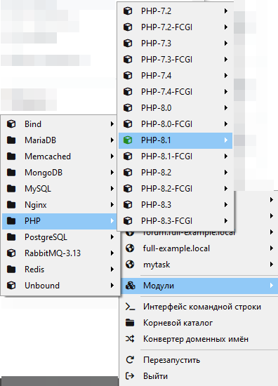
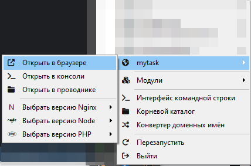

# MyTasks

## Описание
Веб-приложение для создания заметок.
Пользователи могу ставить себе задачи, редактировать, удалять и смотреть их.

## Как скачать данное веб-приложение?
1. Скачать OpenServer и Git;
2. Открыть OpenServer, в настройках OpenServer и найти пункт модули;
3. Настроить модули как показано на картинке;


4. Перезапустить OpenServer и зайти в командную строку:

5. Выполнить следующие команды в консоле OpenServer:

```
git clone https://github.com/Anna2002k/MyTasks.git
cd home/mytask
composer install
php artisan migrate
```
6. Запустите OpenServer, выберите mytask, открыть в браузере:


Теперь приложение готово для использования!
