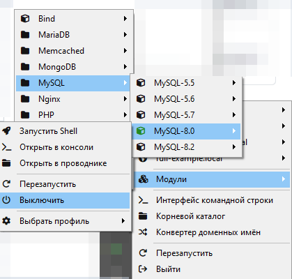
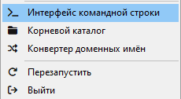
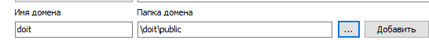

# DoIt

## Описание
DoIt - веб-приложение созданно для того чтобы создаваь в нем заметки.
Пользователи могу ставить себе задачи, редактировать, удалять и смотреть их.

## Как скачать данное веб-приложение?
1. Скачайте себе OpenServer и Git;
2. Откройте OpenServer(Нажав на красный флажок в панеле задач), затем зайдите в настройки OpenServer и найдите пункт модули;
3. Настройти модули как показано на картинке;

4. После того как Вы настроили модуль Вам нужно зайти в папку с проектами, там нужно открыть командную консоль просто введя в поисковую строку ```cmd```, как показано на картинке.

5. Открыв консоль Вам нужно выполнить следующии команды:

```
git clone https://github.com/URLbug/DoIT.git
cd DoIT
php artisan migrate 
``` 

__Если у Вас нету php то выполните команды в консоле OpenServer(Дополнительно/Консоль)__

```
cd domains/DoIT
php artisan migrate 
```

6. Зайдите опять в настройки OpenServer, откройте пункт "Домены" и добавти домен как на картинке:

7. Запустите OpenServer и перейдите по ссылке в браузере ```doit/```

Все теперь Вы можете спокойно использовать DoIt для заметок!
